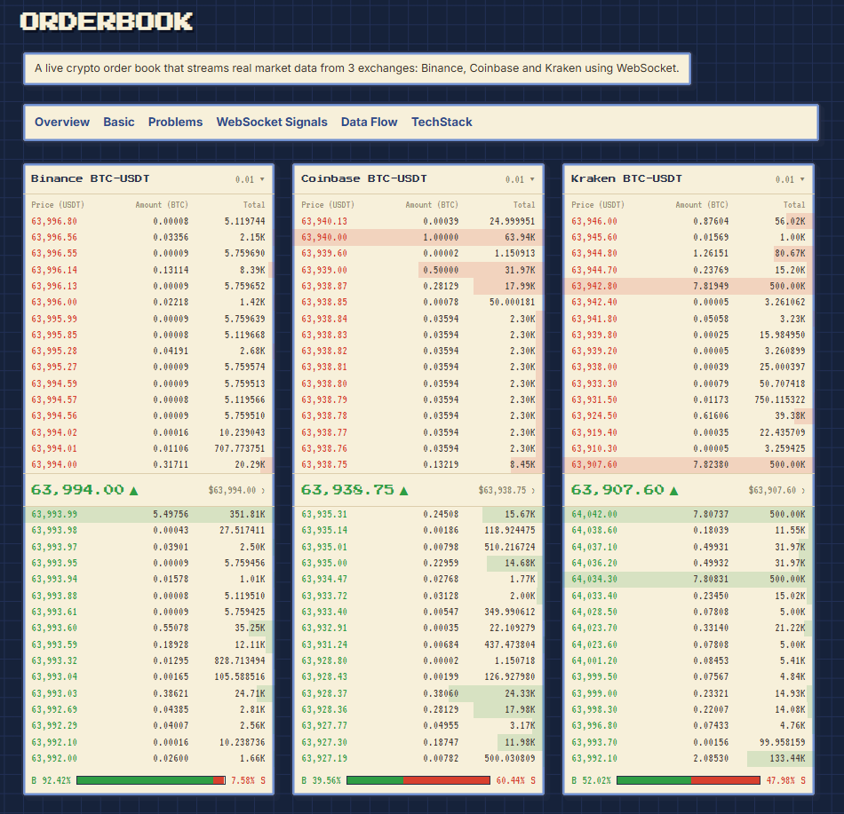
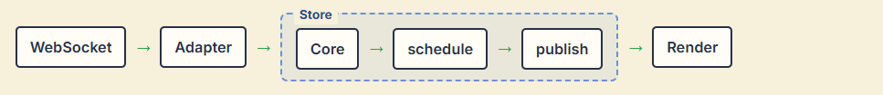
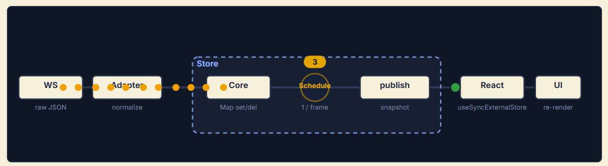

<div align="center">

# Orderbook

Orderbook stream dữ liệu thật từ nhiều sàn qua WebSocket.




</div>

## Tổng quan

Dữ liệu order book từ **Binance** và **Coinbase** (kèm một **Test feed** chạy offline) được lấy qua WebSocket, chuẩn hoá về cùng một format, cập nhật vào local order book, rồi mới render.



- **1. WebSocket**: nhận dữ liệu market depth từ từng sàn, gồm snapshot ban đầu và các bản cập nhật realtime.
- **2. Adapter**: chuẩn hoá định dạng riêng (normalization) của mỗi sàn về một model chung.
- **3. Store**: nhận event, cập nhật local orderbook và quyết định khi nào hiển thị.
  - **Core**: engine tạo/ cập nhật local orderbook mỗi signal, và trả snapshot khi cần render.
  - **schedule**: gộp các update event, hẹn render tối đa 1 lần mỗi khung hình (`requestAnimationFrame`).
  - **publish**: lấy snapshot local orderbook ở thời điểm hiện tại để render.
- **4. Render**: React đọc snapshot, chỉ những dòng thay đổi mới re-render.

## Model & các field chính

Model Orderbook là 1 object có chứa 2 HashMaps Asks & Bids (Map<price, amount>):

```ts
BookSnapshot {
  bids: Level[]     // đã sort giá GIẢM dần, lấy top-N
  asks: Level[]     // đã sort giá TĂNG dần, lấy top-N
  version: number   // tăng mỗi lần publish → React re-render
}
Level { price, quantity }   // lưu trong Map<price, quantity>
```

## Các bài toán khi build order book

**1. Mất một tín hiệu là sai cả sổ.** 

Sổ tại thời điểm T = snapshot ban đầu + toàn bộ update áp đúng thứ tự tới T. Chỉ cần rớt một update là sổ lệch, và lệch mãi.


Hướng xử lý: Mỗi event mang `sequence / update-id`. Đứt chuỗi (gap) thì coi như sổ hỏng → lấy snapshot mới và resync. Nhiều sàn còn gửi checksum (CRC32 top-N) để tự kiểm.

**2. Quá nhiều tín hiệu mỗi giây.** 

Sàn đẩy hàng nghìn update/giây, màn hình 60Hz chỉ vẽ ~60 frame/giây.

Hướng xử lý: Tách "cập nhật orderbook" khỏi "re-render UI": apply mọi update ngay, nhưng chỉ publish snapshot sang React tối đa 1 lần mỗi frame (`requestAnimationFrame`).

**3. Cập nhật local orderbook (chọn cấu trúc dữ liệu):** 

Orderbook có **N** price levels. Mỗi update có thể thay đổi **M** levels. Tổng cộng nhận &&K** updates. Vậy chi phí update tổng cộng là bao nhiêu?

| | update | tạo snapshot cho UI |
| :--- | :--- | :--- |
| **HashMap** | `O(K × M)` | `O(N log N)` (phải sort) |
| **Sorted Tree** | `O(K × M × log N)` | `O(N)` |

Project này dùng `Map<price, quantity>` để update nhanh, rồi sort khi tạo UI snapshot; sẽ cân nhắc Sorted Tree nếu gặp vấn đề performance.

**4. Orderbook quá lớn để render:** 

Orderbook lớn có hàng nghìn dòng thì xử lý ra sao?

Hướng xử lý:
1. **Top-N levels**: chỉ hiển thị 20–50 mức gần market nhất.
2. **Virtualization**: chỉ mount những row trong viewport khi cần scroll sâu.

## 2 tín hiệu WebSocket: Snapshot vs Update

Sau khi subscribe, sàn chỉ gửi về **2 loại tín hiệu**:

- **SNAPSHOT**: trạng thái sổ tại một thời điểm (bids + asks trong phạm vi depth). Dùng để khởi tạo hoặc dựng lại local orderbook. Lấy lúc sync, reconnect, hoặc khi phát hiện sổ lệch.
- **UPDATE (delta)**: chỉ những dòng thay đổi của bids / asks. Dùng để cập nhật sổ đang có, được gửi liên tục.

> `quantity` trong mỗi update là **giá trị mới** tại price level đó, không phải phần chênh lệch. Khi nhận update, local orderbook **replace** quantity hiện tại. Nếu `quantity = 0` thì **xoá** price level đó.

## Data Flow

Market update được apply vào local orderbook ngay khi nhận được. Nhưng thay vì báo cho React sau mỗi thay đổi, store gom các thay đổi lại và chỉ publish snapshot mới tối đa một lần mỗi animation frame.



## Tech Stack

- React 19 · TypeScript · Vite
- useSyncExternalStore
- Native WebSocket

## Chạy local

```bash
npm install
npm run dev
```

```bash
npm run build
npm run typecheck
```
